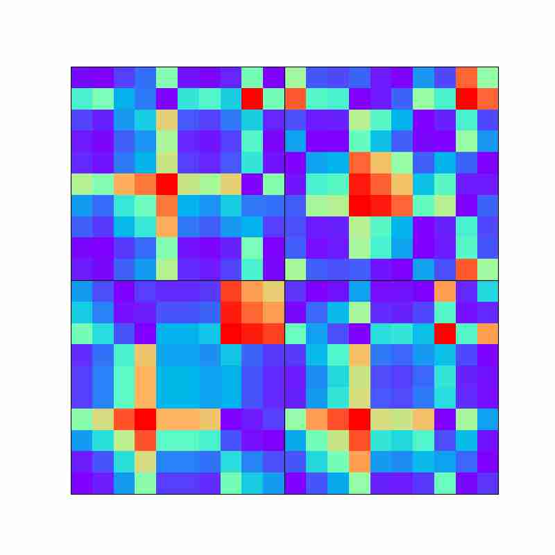

Gramian Angular Field Generator

I needed a fast gramian angular field generator for a project I am working on. So I built one. 

Takes in a csv file and generates the GAF's (Either Summation or Difference) using ray for parallelism
below is a sample output. 

 
